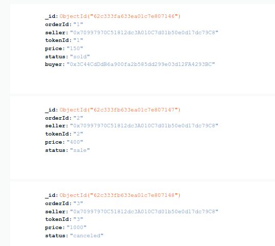

# Reading event logs using `geth`

*Keywords: `geth`, `mongodb`, `local Hardhat Network`*

## Preparation:
- Connect to [mongodb Atlas cluster](https://www.mongodb.com/docs/drivers/go/current/quick-start/).
- Generate `market.go`:
    - Run `npx hardhat compile`
    - Find & copy Market's ABI located in `artifacts` folder
    - Paste it to a new file named `Market.abi`
    - Use [abigen](https://goethereumbook.org/smart-contract-compile/) to generate `market.go` which is used to parse event's data

## Step 1:
- Run local Hardhat Network:
```
cd contract
npx hardhat node
```
- Open another terminal, then deploy contracts & call `Market.sol`'s functions by running:
```
npx hardhat run scripts/deploy_contracts.js --network localhost
npx hardhat run scripts/buy_and_sell.js --network localhost
```

## Step 2:
- Read event logs emitted by Market contract and save them to mongodb:
```
cd api
go run main.go
```

## Result
Event logs are read using geth and saved to database (mongodb):



## References

- [Reading ERC-20 Token Event Logs | goethereumbook.org](https://goethereumbook.org/event-read-erc20/)
- [Usage Examples | mongodb.com](https://www.mongodb.com/docs/drivers/go/current/usage-examples/)